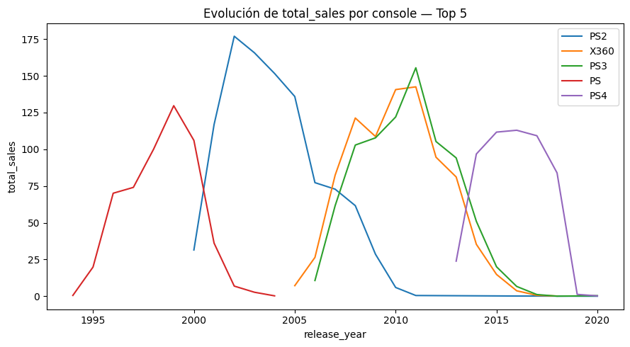
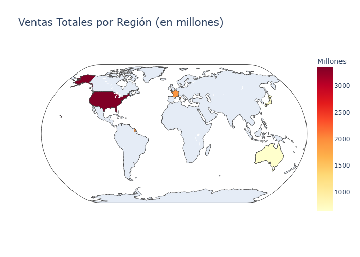
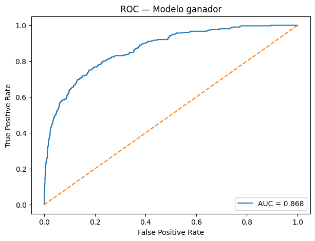
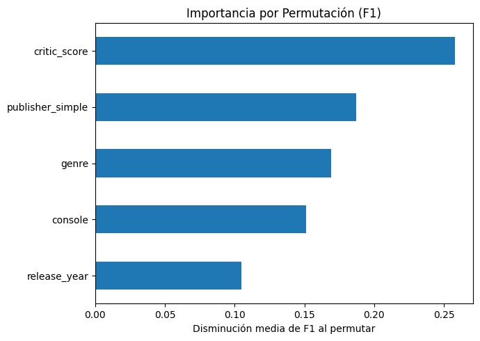

# Análisis y predicción del éxito de videojuegos

> Proyecto de análisis de datos y *machine learning* para predecir el éxito comercial de videojuegos a partir de datos históricos de mercado.

Proyecto realizado en el marco del **Máster de Big Data de la UNED (2025)**, centrado en el análisis de un dataset histórico de más de **64.000 videojuegos** y en la construcción de un modelo de *machine learning* capaz de predecir si un videojuego será un **éxito comercial**.

En este trabajo, se define como éxito comercial superar **1 millón de ventas globales** (`total_sales >= 1.0`).

**[Ver la memoria completa del proyecto](https://ivanaraque.github.io/analisis-prediccion-videojuegos/memoria/Ivan_Araque_Lopez_Memoria.html)** — informe redactado en RMarkdown con el desarrollo completo del análisis.

## Objetivo del proyecto

El objetivo principal es desarrollar un modelo de clasificación que permita predecir el éxito potencial de un videojuego a partir de variables conocidas como:

- `critic_score`
- `console`
- `genre`
- `release_year`
- `publisher_simple`

Además del modelado, el proyecto incluye una fase completa de:

- limpieza y preprocesado de datos
- análisis exploratorio (EDA)
- visualización de patrones y tendencias
- comparación de modelos
- interpretación de resultados

## Dataset

- **Fuente:** Kaggle  
  Video Games Dataset:  
  https://www.kaggle.com/datasets/ujjwalaggarwal402/video-games-dataset/data

- **Licencia del dataset:** Apache 2.0  
  https://www.apache.org/licenses/LICENSE-2.0

El dataset contiene información histórica de **64.017 videojuegos**, incluyendo variables como plataforma, género, publisher, puntuaciones de crítica y ventas por región.

## Tecnologías y librerías utilizadas

Este proyecto se ha desarrollado principalmente con **Python**, utilizando las siguientes librerías:

- **pandas** y **numpy** para manipulación de datos
- **matplotlib** y **seaborn** para visualización
- **scikit-learn** para preprocesado, validación y evaluación
- **XGBoost** para el modelo final
- **plotly** para algunas visualizaciones geográficas

## Proceso realizado

### 1. Análisis exploratorio de datos

Se realizó una inspección inicial del dataset para estudiar:

- tipos de variables
- valores nulos
- duplicados
- distribución de ventas
- variables categóricas principales
- evolución temporal de ventas por consola
- correlaciones entre ventas por región y ventas totales





### 2. Preprocesado

Entre las transformaciones realizadas destacan:

- eliminación de columnas irrelevantes (`img`)
- conversión de fechas a formato `datetime`
- imputación de valores nulos
- simplificación de publishers en una categoría top 20 + `Other`
- creación de variables derivadas como:
  - `release_year`
  - `age_days`

Además, el preprocesado se integró dentro de un **Pipeline** con `ColumnTransformer` para evitar **data leakage**.

### 3. Modelado

Se compararon varios algoritmos de clasificación:

- Regresión Logística
- SVM lineal calibrado
- Árbol de decisión
- Random Forest
- XGBoost

Debido al desbalance de clases, se priorizaron métricas robustas como:

- **F1-Score**
- **Balanced Accuracy**
- **ROC AUC**

### 4. Optimización y evaluación final

El modelo final seleccionado fue **XGBoost**, tras superar al resto en validación cruzada.  
Posteriormente se aplicó:

- optimización de hiperparámetros con `RandomizedSearchCV`
- ajuste del umbral de decisión para maximizar F1
- validación temporal por año de lanzamiento
- análisis de importancia de variables mediante **Permutation Importance**

## Resultados principales

El mejor modelo fue **XGBoost**, que obtuvo el mejor equilibrio entre métricas durante la fase comparativa.

### Métricas en test

- **F1-Score final en test:** `0.493`
- **ROC AUC en test:** `0.868`
- **Average Precision (PR):** `~0.48`



### Hallazgos relevantes

- `critic_score` fue la variable más influyente en la predicción.
- `publisher_simple`, `genre` y `console` también tuvieron un peso importante.
- Norteamérica y Europa aparecen como los mercados más relevantes en ventas globales.
- El problema presenta un **fuerte desbalance de clases**, ya que solo alrededor del **8%** de los videojuegos analizados alcanzan el umbral de éxito.



## Limitaciones

Este proyecto presenta algunas limitaciones importantes:

- El dataset es **histórico** y no refleja completamente la situación actual del mercado.
- Existen muchas observaciones con valores faltantes, especialmente en `critic_score` y variables de ventas.
- No se incluyen factores externos relevantes como:
  - presupuesto de marketing
  - popularidad en redes sociales
  - reputación previa de la franquicia
  - contexto competitivo del lanzamiento

## Estructura del repositorio

- `anexos/` — notebook con todo el código del análisis
- `data/` — dataset original
- `memoria/` — memoria del proyecto (RMarkdown y HTML) e imágenes

## Cómo reproducirlo

1. Clona el repositorio. El dataset ya está incluido en `data/`.
2. Instala las dependencias:
```
   pip install pandas numpy matplotlib seaborn plotly scikit-learn xgboost
```
3. Abre `anexos/Ivan_Araque_Lopez_Analisis_Videojuegos.ipynb` y ejecútalo de arriba abajo.
