```{r setup, include=FALSE}
#knitr::opts_chunk$set(echo = TRUE)

#install.packages("tinytex")
#tinytex::install_tinytex()

```


# 1. Resumen / Abstract

Este proyecto, realizado en el marco del Máster de Big Data de la UNED, analiza un dataset histórico de más de 64.000 videojuegos con el objetivo de predecir su éxito comercial (definido como superar el millón de ventas globales). Tras un análisis exploratorio y la preparación de los datos, se compararon diversos algoritmos de clasificación, siendo XGBoost el que alcanzó el mejor equilibrio entre métricas. El modelo final, optimizado y con ajuste de umbral, obtuvo un F1-Score de 0,493 en el conjunto de prueba. 
Estos resultados demuestran la viabilidad de emplear técnicas de machine learning como apoyo a la toma de decisiones estratégicas en marketing e inventario dentro de la industria del videojuego.


# 2. Introducción y Objetivos

## 2.1 Introducción

La industria del videojuego es un sector global multimillonario en auge, caracterizado por una alta competencia, elevados costes de desarrollo y un alto grado de incertidumbre en el éxito de sus lanzamientos. Para las empresas o developers de videojuegos, la capacidad de poder estimar el potencial de un nuevo título, antes de salir a la luz, es una ventaja competitiva fundamental. Una predicción acertada permite optimizar el marketing, gestionar el inventario eficientemente, y enfocar las estrategias hacia las plataformas con el mayor potencial.

Este proyecto, busca explorar la viabilidad de utilizar técnicas de análisis de datos y machine learning para abordar este problema. Para ello, utilizaremos un dataset histórico de videojuegos, disponible en la plataforma Kaggle, donde se analizarán las características que históricamente se han correlacionado con altas ventas,
La meta es desarrollar un modelo predictivo que pueda servir como herramienta de apoyo para clasificar el éxito potencial de un nuevo videojuego, aportando así datos cuantitativos a las decisiones empresariales.


## 2.2. Objetivos

El proyecto se estructura en torno a un objetivo general, y varios específicos del análisis.

### Objetivo General
Desarrollar un modelo de clasificación que permita predecir si un videojuego será un éxito comercial, considerando "éxito comercial" como superar el millón de ventas totales. Todo esto basándose en sus características conocidas.

### Objetivos del Análisis

Para alcanzar el objetivo general, se plantean los siguientes hitos:

- Realizar un análisis exploratorio de datos(EDA) para limpiar, procesar y entender las características del dataset.

- Visualizar las relaciones entre variables clave y las ventas.

- Construir y comparar diferentes modelos de machine learning.

- Evaluar y seleccionar el modelo con el mejor rendimiento, utilizando las métricas adecuadas.

- Interpretar el modelo ganador para identificar los factores más influyente en el éxito de un videojuego.

### Alcance y Limitaciones


#### Alcance: 

El análisis se limita a los datos incluidos en el dataset de Kaggle. La definición de éxito, está estrictamente definida al umbral del millón de ventas, y las predicciones se basan únicamente en las variables disponibles en el conjunto.


#### Limitaciones:

- Datos Históricos: El dataset tiene datos de varias décadas, pero no actualizados del todo a hoy en día, por lo que puede que las tendencias no reflejen completamente la dinámica actual del mercado.

- Datos Faltantes: El conjunto de datos presenta una gran cantidad de valores nulos, sobre todo en columnas como 'critic_score'. Esto limita el número de registros disponibles para el entrenamiento.

- Variables no incluidas: El modelo no tiene en cuenta factores externos, como por ejemplo el presupuesto destinado a marketing, o el sentimiento de la comunidad en redes sociales, ya que no están presentes en los datos.


# 3. Revisión y descripción del dataset

## 3.1. Fuente y licencia

En primer lugar, este dataset ha sido obtenido en Kaggle, en la siguiente url:
https://www.kaggle.com/datasets/ujjwalaggarwal402/video-games-dataset/data

Este dataset se encuentra bajo la licencia Apache 2.0 https://www.apache.org/licenses/LICENSE-2.0 , que permite su uso, modificación y redistribución siempre que se mantenga la atribución y se indiquen los cambios realizados.
En este trabajo se ha adaptado el dataset mediante limpieza y transformación de variables.


## 3.2. Carga de librerías y datos

Para llevar a cabo el análisis, se utilizarán las siguientes librerías de Python.
Es posible que algunas de ellas no vengan instaladas por defecto en un entorno de R o RStudio, por lo que se recomienda verificar su instalación a través del gestor de paquetes pip antes de ejecutar el código del anexo.


```{r librerías, eval=FALSE, echo=TRUE}

# Carga de librerías utilizadas

# Tratamiento de datos
import pandas as pd
import numpy as np
import warnings
warnings.filterwarnings('ignore')

# Visualizaciones
import matplotlib.pyplot as plt
import seaborn as sns

```

A continuación, se procede a la carga del dataset.
Para reproducir este paso, es necesario descargar el archivo desde su fuente original, o de la carpeta "data" en el proyecto, y ubicarlo en el directorio de trabajo.


```{r carga_datos, eval=FALSE, echo=TRUE}

df = pd.read_csv('Video Games Data.csv')

```

## 3.3. Características del dataset

Este dataset encontrado en Kaggle contiene los datos principales de 64,017 videojuegos, además de otros datos con gran valor a la hora de analizar, como sus puntuaciones en cuanto a críticas, y su información de ventas por región y totales.
Vamos a realizar un primer análisis con el método '.info()', el cual nos revelará la estructura de los datos, incluyendo tipos de variable, y la presencia de valores nulos.


```
RangeIndex: 64017 entries, 0 to 64016
Data columns (total 14 columns):
 #   Column        Non-Null Count  Dtype  
---  ------        --------------  -----  
 0   img           64017 non-null  object 
 1   title         64017 non-null  object 
 2   console       64017 non-null  object 
 3   genre         64017 non-null  object 
 4   publisher     64017 non-null  object 
 5   developer     64000 non-null  object 
 6   critic_score  6678 non-null   float64
 7   total_sales   18922 non-null  float64
 8   na_sales      12637 non-null  float64
 9   jp_sales      6726 non-null   float64
 10  pal_sales     12824 non-null  float64
 11  other_sales   15128 non-null  float64
 12  release_date  56965 non-null  object 
 13  last_update   17879 non-null  object 
dtypes: float64(6), object(8)
```
El método nos confirma que varias columnas(especialmente 'critic_score' y algunas cifras de ventas) tienen muchos datos ausentes. Además, de que vemos que hay columnas como las fechas('release_date' y 'last_update') que tendremos que cambiar de tipo.

Realizando un análisis con .describe(), veremos un primer resumen estadístico de las variables numéricas.

```{r df_describe, echo=FALSE, fig.cap="", out.width="70%", fig.align='center'}

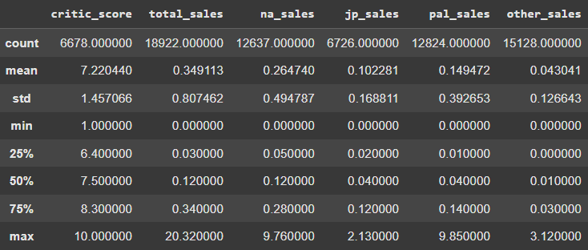

```

Esta tabla nos confirma que hay un rango bastante amplio de datos, sobre todo en las ventas totales, lo cual indica que deberemos de tener cuidado con los datos nulos en la fase de pre-procesado.

A continuación, para entender en detalle el contenido de cada campo, vamos a ver el diccionario de variables.
Por suerte, junto al dataset principal, se proporciona el archivo "vg_data_dictionary.csv"(localizado en la carpeta "data" de este projecto), el cual contiene la descripción de cada una de las columnas. 
Hemos cargado directamente dicho archivo.

```{r dictionary, echo=FALSE}

library(readr)
library(knitr)

# Cargar diccionario
diccionario <- suppressMessages( #Para que no muestre los tipos al principio
  read_csv("data/vg_data_dictionary.csv")
)

# Mostrar como tabla
kable(diccionario, caption = "Diccionario de variables del dataset de videojuegos")

```


# 4. Análisis exploratorio y pre-procesado de datos

## 4.1. Limpieza y transformación de variables

Hemos llevado a cabo los siguientes pasos de pre-procesado:

- **Eliminación de columnas innecesarias:** Eliminamos la columna "img", ya que no aportaba ningún valor al modelo.
```{r EDA_elim_img, eval=FALSE, echo=TRUE}

df.drop(columns=['img'], inplace=True)

```

- **Conversión de fechas:** Las columnas 'release_date' y 'last_update' se convirtieron el a formato **datetime**.
```{r EDA_elim_dates, eval=FALSE, echo=TRUE}

df['release_date'] = pd.to_datetime(df['release_date'], errors='coerce')

df['last_update'] = pd.to_datetime(df['last_update'], errors='coerce')

```

- **Imputación de valores nulos:** Los valores nulos en 'developer' se rellenaron como 'Unknown'. El resto de nulos se tratarán durante la construcción del pipeline del modelo(para evitar fuga de datos).
```{r EDA_elim_na, eval=FALSE, echo=TRUE}

#Vemos cuantos valores NA hay en cada columna
values_na_perc = df.isna().mean() * 100
print(values_na_perc.sort_values(ascending=False))

# Developer tiene un porcentaje de NA bajo, los reemplazamos por 'Unknown'
df['developer'].fillna('Unknown', inplace=True)

```

- **Creación de nuevas variables:** Creamos las siguientes variables:
```{r EDA_elim_vars, eval=FALSE, echo=TRUE}

# Los publishers que no estén en el top 20, se llamarán "Other"
top_publishers = df["publisher"].value_counts().head(20).index
df["publisher_simple"] = np.where(df["publisher"].isin(top_publishers), df["publisher"], "Other")


# Creo nueva columna de los días de vida(desde la fecha desde que salío el juego, hasta su última update).
df['age_days'] = (df['last_update'] - df['release_date']).dt.days
df.loc[df['age_days'] < 0, 'age_days'] = np.nan #quito los negativos, para evitar posibles errores de calidad de datos.


# Recuperamos el año como número entero. Será útil para gráficas más adelante.
df['release_year'] = df['release_date'].dt.year.astype('Int64')
```

- **Manejo de duplicados:** Se encontraron un total de 20 filas duplicadas, las cuales se mantuvieron debido a su bajo impacto.
```{r EDA_elim_dup, eval=FALSE, echo=TRUE}

duplicados = df.duplicated().sum()
print(f'Filas duplicadas: {duplicados}')
if duplicados > 0:
    print(df[df.duplicated(keep=False)].head(5))

# Conteo de valores únicos por columna(en orden descendente). Esto ayuda a ver cardinalidades.
print('')
print('Valores únicos')
print(df.nunique(dropna=False).sort_values(ascending=False))

```

## 4.2. Visualizaciones y análisis de variables

### Muestra de gráficos sencillos

#### Histograma de 'critic_score'

```{r hist_critic-score, echo=FALSE, fig.cap="", out.width="50%", fig.align='center'}

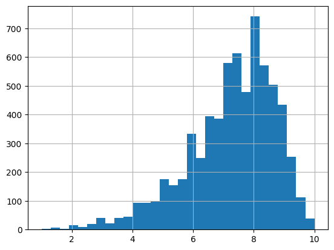

```

#### Distribución de 'total_sales'

Para comprender la distribución de las ventas, hemos generado gráficos Boxplot con la variable 'total_sales'.

```{r boxplot_sales, echo=FALSE, fig.cap="", out.width="50%", fig.align='center'}

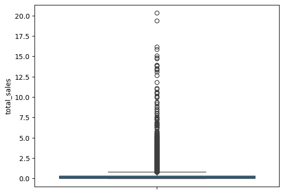

```

En esta primera imagen, podemos ver como el Boxplot de ventas totales aparece completamente aplastado en la parte inferior, debido a la asimetría de los datos. La caja es prácticamente una línea en el cero, lo cual indica que la mayoría de los títulos tienen ventas bajas. Además, se puede ver que los valores extremadamente altos, los cuales estiran el eje vertical del gráfico, lo cual lo hace más dificil de analizar.

Para solucionar este problema de asimetría, hemos aplicado una transformación logarítmica.

```{r boxplot_sales_log, echo=FALSE, fig.cap="", out.width="50%", fig.align='center'}

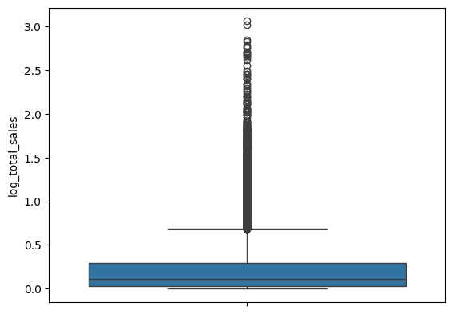

```

Esto hace el gráfico mucho más informativo. Ahora, la caja es mucho más visible, al haber "descomprimido" los datos de la parte inferior, lo cual nos hace poder ver donde está su mediana, y entender mejor la dispersión del 50% central de los juegos. Este gráfico nos confirma que la mayoría de los videojuegos tienen ventas bajas, pero de una forma visualmente más clara y analizable.


### Visualización de categorías principales

Para identificar las categorías más representativas de este dataset, hemos generado gráficos de barras con el top 10.

#### Top 10 Géneros
En el análisis de los géneros más comunes, se observa una predominancia de los géneros 'Misc' , 'Action' y 'Adventure'. La categoría 'Misc' es notablemente la más frecuente, lo que sugiere una gran cantidad de títulos que no encajan en las clasificaciones tradicionales o que abarcan múltiples géneros.

```{r hist_genre, echo=FALSE, fig.cap="", out.width="75%", fig.align='center'}

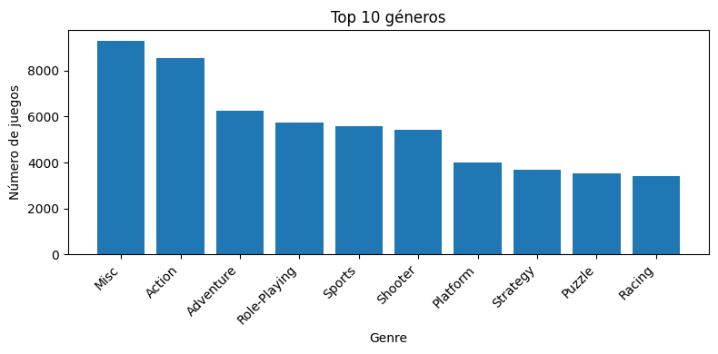

```

#### Top 10 Consolas
En cuanto a las plataformas, el PC es con diferencia la consola con el mayor número de títulos publicados en este dataset. Esto refleja su naturaleza como plataforma abierta en comparación con los ecosistemas cerrados de las consolas tradicionales. Le siguen plataformas que han tenido un gran éxito histórico como la PS2 y la Nintendo DS.

```{r hist_console, echo=FALSE, fig.cap="", out.width="75%", fig.align='center'}

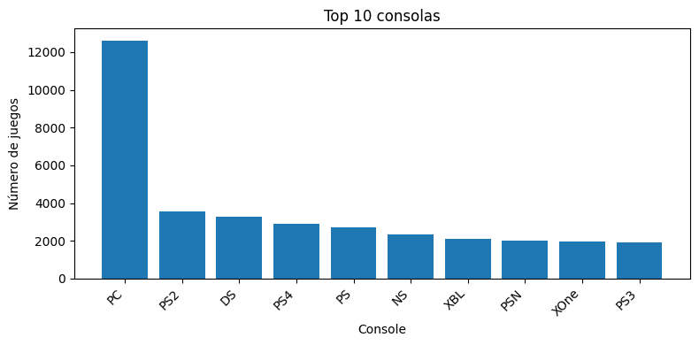

```

#### Top 10 Publishers
Al analizar los publishers con mayor cantidad de juegos lanzados, Sega se posiciona como el líder en este dataset, superando los 2000 títulos. Le siguen de cerca otras grandes compañías de la industria como Ubisoft, Electronic Arts y Activision.
Es interesante notar la presencia de compañías con una larga trayectoria histórica, lo que sugiere que el volumen de juegos publicados a lo largo de varias décadas es un factor clave para figurar en este ranking.

```{r hist_publisher, echo=FALSE, fig.cap="", out.width="75%", fig.align='center'}

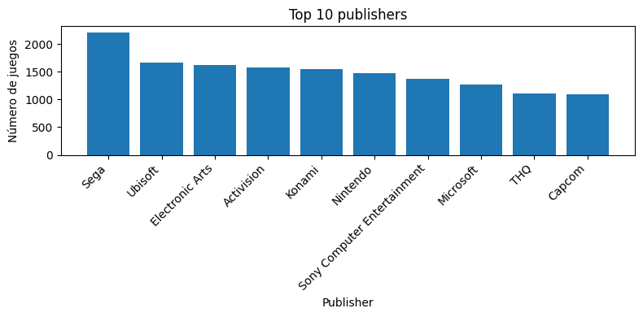

```


### Visualización de ventas por región
Para entender mucho mejor la distribución geográfica de las ventas, hemos creado un mapa de ventas por región. Este gráfico utiliza diferentes tonalidades de color para representar los diferentes valores de datos. Esto nos ayuda a ver fácilmente cuáles son los mercados más importantes.

```{r mapa_ventas_region, echo=FALSE, fig.cap="", out.width="85%", fig.align='center'}

knitr::include_graphics("img/mapa_ventas_region.png")

```

Este mapa nos muestra lo siguiente: 
Los colores más intensos están concentrados en Norte América(NA) y Europa(PAL), lo cual quiere decir, que estas regiones son los mercados más importantes en ventas de videojuegos. 
Tambien, podemos ver que en Japón, hay un gran mercado de videojuegos, aunque visiblemente menor que las anteriores.
Además, las 'other_sales', aunque menores, las podemos ver en regiones como Australia, las cuales siguen siendo bastante relevantes para las ventas totales.
En resumen, el mapa confirma que cualquier estrategia para un lanzamiento global, debería considerar priorizar los mercados de Norteamérica y Europa, que constituyen una gran parte de las ventas.


### Evolución de ventas totales por consola

Uno de los análisis más interesantes, es observar como han evolucionado las ventas de las consolas más populares, a lo largo del tiempo. Este análisis nos permite ver fácilmente los ciclos de vida de cada plataforma, y comparar sus rendimientos. 
Para ello, primero hemos utilizado la variable 'release_year', creada anteriormente, la cual nos enseñará el año como número entero:

Una vez creada la variable, nos disponemos a crear la evolución de total_sales de las 5 consolas más importantes a lo largo del tiempo.

```{r ventas_por_consola_over_time, echo=FALSE, fig.cap="", out.width="85%", fig.align='center'}

knitr::include_graphics("img/evo_totalsales_overtime.png")

```

Aunque este gráfico es útil para ver los rendimientos de las consolas más importantes, en su contexto histórico, resulta difícil comparar sus ciclos de vida, ya que han sido lanzadas en años diferentes.

Para solucionar esto, hemos alineado el inicio de cada consola a su "año 0" de vida. De esta manera, podemos comparar su trayectoria directamente con el resto de consolas.

```{r ventas_por_consola_comparadas, echo=FALSE, fig.cap="", out.width="85%", fig.align='center'}

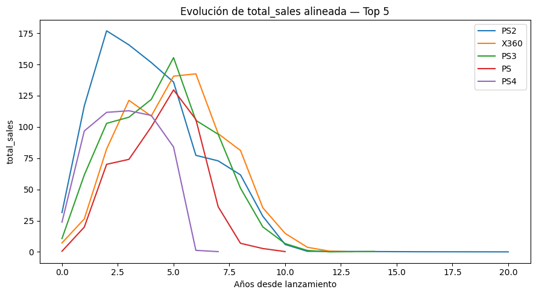

```

Este enfoque nos muestra mucho más fácilmente las comparaciones entre consolas. Se puede ver el rápido crecimiento de la PS2, la cual alcanzó la mayor parte de sus ventas en sus primeros 5 años desde su lanzamiento aproximadamente.

Finalmente, para entender mejor la velocidad de ventas de las consolas, hemos utilizado una curva de ventas acumulada.

```{r ventas_por_consola_comparadas_acumulada, echo=FALSE, fig.cap="", out.width="85%", fig.align='center'}

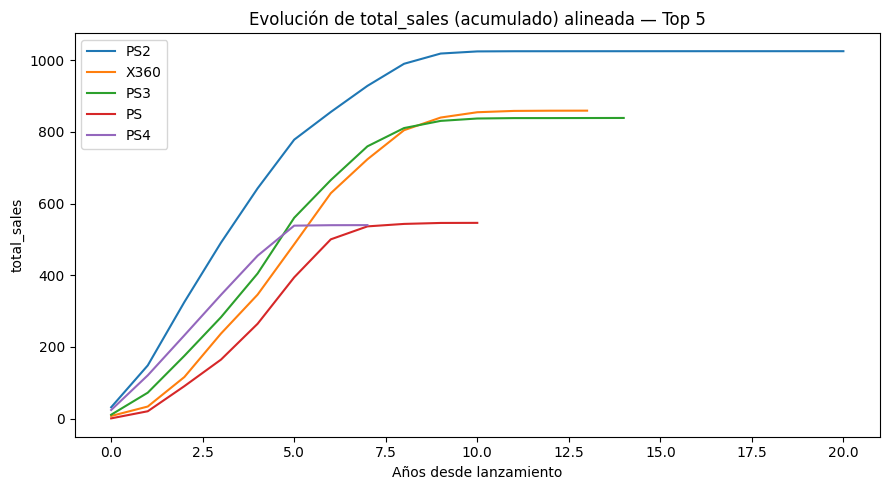

```

Con esta vista, podemos confirmar el rápido y gran crecimiento de la PS2, además del sólido crecimiento a lo largo del tiempo de la X360 y la PS3, que llegaron a cifras acumuladas muy similares.

Es importante notar, que el ranking de consolas por ventas totales(liderado por PS2, X360, PS3), difiere del ranking de número de títulos enseñado anteriormente, el cual es liderado por PC. Esto indica que no siempre la cantidad de juegos publicados se traduce en un mayor número de ventas.


## 4.3. Estudio de Correlaciones entre variables

### Relación entre 'console' y las ventas

Para profundizar en la distribución de las ventas, el siguiente boxplot desglosa las ventas totales (en escala logarítmica) por las consolas más representativas del dataset.

```{r boxplot_sales_console_log, echo=FALSE, fig.cap="", out.width="70%", fig.align='center'}

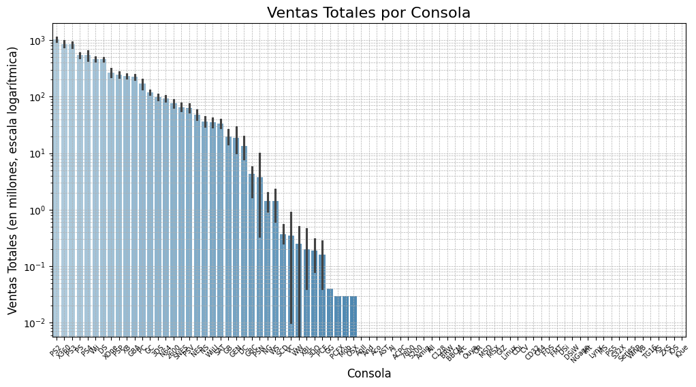

```

Este gráfico no solo confirma la existencia de numerosos títulos con ventas extremadamente altas(outliers), en casi todas las plataformas, sino que también revela diferencias significativas en el rendimiento mediano. 
La PS2, por ejemplo, destaca por tener una mediana de ventas superior a la mayoría, lo que se alinea con su conocido éxito histórico como una de las consolas más vendidas de todos los tiempos. 
Es crucial interpretar estos datos en su contexto histórico; aunque un juego de PS2 tuviera un gran rendimiento en su día, estas cifras no son directamente extrapolables a lanzamientos actuales en plataformas modernas.


### Relación entre 'critic_score' y las ventas

Para explorar la relación entre la nota de críticas de un juego, y su éxito comercial, hemos generado un gráfico de dispersión que compara el 'critic_score' con las 'total_sales'. Dado a que los datos de las ventas presentan una gran dispersión, hemos utilizado una escala logarítmica en su eje.

```{r scatterplot_ventas_criticscore, echo=FALSE, fig.cap="", out.width="75%", fig.align='center'}

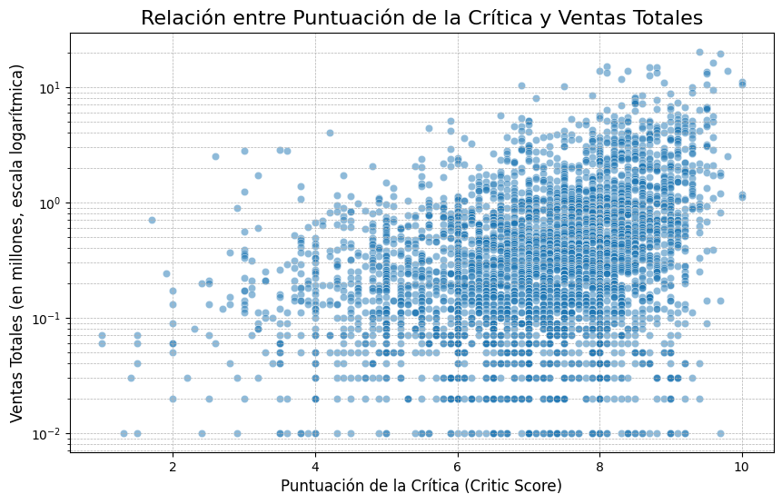

```

El gráfico muestra una clara tendencia positiva: a medida que aumenta la puntuación de la crítica, las ventas totales tienden a incrementar a su vez. Esto sugiere que los juegos mejor valorados por la crítica, tienen una mayor probabilidad de alcanzar cifras de ventas más altas.
Sin embargo, el gráfico muestra además una dispersión bastante alta, sobre todo para los juegos con altas puntuaciones. Esto quiere decir que la puntuación es un buen indicador del éxito potencial, pero no una garantía. Existen muchos otros factores que también juegan un papel crucial en el rendimiento comercial final de un videojuego.


### Correlación entras las ventas por región

A continuación, procedemos a crear la matriz de correlación entre las ventas por región y las ventas totales, para entender la relación entre las ventas regionales, y el éxito global de un videojuego.

```{r corr_ventas, echo=FALSE, fig.cap="", out.width="75%", fig.align='center'}

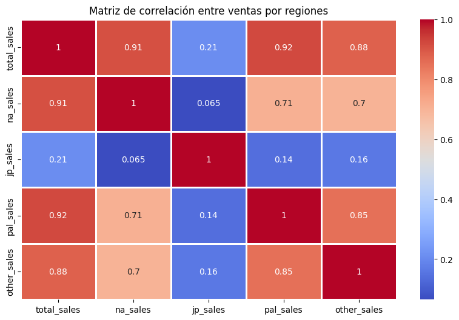

```

De esta matriz podemos extraer varias conclusiones clave:
- Existe una fuerte correlación entre las 'na_sales' y las ventas totales(0,91), y en las 'pal_sales' con las totales(0,92). Esto quiere decir, que el rendimiento de un videojuego en estos dos mercados, será muy fiable a la hora de predecir su éxito global.
- Las ventas 'ja_sales' se comportan de manera bastante independiente, con una correlación de un 0,21 con las ventas totales. Además de que la correlación de 'ja_sales' con el resto de ventas regionales, es aún más baja. Esto indica claramente que las preferencias del mercado japonés son muy diferentes a las del resto del mundo, es decir, un juego que es un éxito en Japón, raramente será un éxito fuera del país.

**Nota sobre la Fuga de Datos:** Para evitar que el modelo obtuviera información "del futuro", lo que inflaría artificialmente su rendimiento, todas las operaciones de preprocesado (como la imputación de nulos o el escalado) se encapsularon dentro de un Pipeline. Esto garantiza que cada transformación se ajuste únicamente con los datos de entrenamiento, asegurando la validez de los resultados.


# 5. Modelos de predicción

En esta sección explico cómo he construido y evaluado los modelos para predecir el éxito comercial de un videojuego.

## 5.1. Definición del problema y variable objetivo

### Objetivo del modelado
El objetivo principal es desarrollar un modelo de clasificación, capaz de predecir con la mayor precisión posible si un nuevo videojuego tendrá éxito (considerando éxito tener más de un millón de ventas). Esta predicción, puede servir como apoyo para desarrolladores y empresas a la hora de tomar decisiones estratégicas, como la asignación de los recursos de marketing o la gestión de expectativas de lanzamiento.

### Variable objetivo
Para cuantificar el éxito, se ha creado una variable binaria llamada 'success'. Como mencionado anteriormente, un videojuego se considera éxito (valor 1) si sus ventas totales ('total_sales') son iguales, o superior a un millón de unidades. En el caso contrario, se considera que no ha tenido éxito (valor 0).

### Desbalance de clases
El conjunto de datos presenta un fuerte desbalance de clases. Solamente un ≈8% de los videojuegos del conjunto del entrenamiento alcanzan la categoría de éxito('success' = 1), mientras que el ≈92% restante no lo hace ('success' = 0).
Esto es muy importante tenerlo en cuenta, ya que un modelo podría lograr una alta precisión, simplemente prediciendo la clase mayoritaria ('success' = 0). Por ello, se deben utilizar métricas y técnicas de modelado que sean robustas ante este escenario.
Para visualizar este desbalance, el siguiente diagrama muestra la proporción de videojuegos que cumplen la condición de éxito (ventas ≥ 1 millón) frente a los que no, dentro del conjunto de datos válido para el entrenamiento.

```{r success_totalsales, echo=FALSE, fig.cap="", out.width="45%", fig.align='center'}

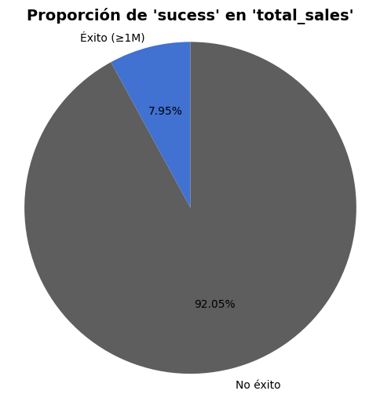

```


## 5.2. Diseño experimental

Para garantizar la validez de los resultados, se ha definido el siguiente diseño experimental,

- **Variables Predictoras:** Se han seleccionado las siguientes variables para predecir la variable 'success'.
  - Numéricas: 'critic_score'.
  - Categóricas: 'console', 'genre', 'release_year', 'publisher_simple'.
  
  
- **Pipeline de Preprocesado:** Para evitar un tratamiento estandarizado y evitar la fuga de datos(data leakage), todas las transformaciones se han encapsulado en un 'Pipeline' de 'scikit-learn' aplicado mediante un ColumnTransformer. Este se integra en cada modelo durante la validación cruzada.

  - Variables numéricas: A las variables numéricas(en este caso únicamente 'critic_score'), se les aplica una imputación de valores faltantes, utilizando la **mediana**. Utilizamos la mediana, en vez de la media, porque la distribución de las ventas y puntuaciones, puede tener valores atípicos, y la mediana es mucho más robusta en estos casos. Posteriormente, se realiza un escalado con 'StandardScaler'. Hacer esto es crucial para modelos como la Regresión Logística, y SVM, cuyos algoritmos son sensibles a la escala de las variables. Sin el escalado, las variables con altos rangos, dominarían el aprendizaje.
  
  - Variables categóricas: A las variables categóricas, se les imputan los valores ausentes con la moda(el valor más frecuente), y luego se transforman mediante One-Hot Encoding. Utilizamos la opción 'handle_unknown'="ignore" para que el modelo no genere errores si en el futuro encuentra una categoría que no estaba presente en el entrenamiento.
  
  
- **Partición de Datos y Validación:** 
  - Los datos se dividieron en dos conjuntos: entrenamiento(80%) y test(20%). Para asegurar que la proporción de la clase éxito fuera la misma en ambas particiones, se utilizó una partición estratificada.
  - Para la evaluación de estos modelos, se utilizó **Validación cruzada de 5 divisiones(K=5)** sobre el conjunto de entrenamiento. Esta validación también fue estratificada para mantener la proporción de clases en cada uno de sus pliegues(folds).
  
  
- **Reproducibilidad:** Para garantizar que los resultados de este estudio sean completamente reproducibles, se ha fijado una semilla aleatoria (SEED = 1234) al inicio del proceso de modelado. De esta manera, cualquier persona que ejecute el código obtendrá exactamente los mismos resultados presentados en esta memoria.
  
  

## 5.3. Selección y Entrenamiento de Modelos

Hemos seleccionado una gran variedad de algoritmos para comparar su rendimiento en el problema propuesto.

### Modelos propuestos:
  - Regresión Logística
  - Support Vector Machine(SVM) Lineal
  - Árbol de decisiones
  - Random Forest
  - eXtreme Gradient Boosting(XGBoost)
  
### Justificación de la Selección

La elección de estos modelos seleccionados nos permite comparar diferentes enfoques:

  - Regresión Logística/SVM: se incluyen como modelos base. Son eficientes, robustos, y sus resultados sirven como un buen punto de referencia.
  - Árbol de Decisiones: Tiene una alta interpretabilidad. Genera reglas fáciles de entender y visualizar, lo cual aporta valor a la hora de comprender los factores de éxito.
  - Random Forest/XGBoost: Combinan múltiples modelos más simples, para lograr una mayor potencia predictiva. Tienen un excelente rendimiento en datos tabulares, y una gran capacidad para encontrar relaciones no líneas bastante complejas.
  
### Consideraciones sobre el Desbalance:

- Para los modelos "Regresión Logística, SVM, Árbol de Decisiones y Random Forest", hemos utilizado el hiperparámetro 'class_weight="balanced"'. Esto modifica la función de pérdida para penalizar más los errores en la clase minoritaria(los videojuegos de "éxito").

- Para XGBoost, hemos empleado el hiperparámetro 'scale_pos_weight', que cumple una función similar y se calcula como el ratio de instancias negativas sobre positivas. En nuestro conjunto de entrenamiento, este valor fue aproximadamente 11.57. Esto significa que, durante el entrenamiento, el modelo penalizará un error en caso de "éxito" casi 12 veces más que en un error de caso de "no éxito".

### Entrenamiento: 
Todos los entrenamientos se realizaron dentro del esquema de validación cruzada descrito anteriormente, para asegurar una comparación justa y fiable de su rendimiento promedio.
El preprocesado se ejecuta dentro de cada fold mediante 'Pipeline'+'ColumnTransformer'. El 'scale_pos_weight' se fija a partir del ratio neg/pos del train global y se explora como hiperparámetro durante la validación cruzada.
  
# 6. Evaluación y resultados

## 6.1. Comparativa de modelos

A continuación, se muestra la tabla con el rendimiento promedio de cada modelo en la validación cruzada. Debido al desbalance de clases, se priorizó F1-Score como métrica principal, ya que representa un equilibrio entre la precisión y el recall de la clase positiva. Además, la Balanced Accuracy también se considera un indicador importante.

(El código para generar esta tabla y los modelos se encuentra en el notebook de python, en los anexos).


```
                    Modelo  Accuracy  Balanced Accuracy      F1   Kappa  ROC AUC
4                  XGBoost    0.8440             0.7449  0.3897  0.3147   0.8413
0      Logistic Regression    0.7385             0.7457  0.3146  0.2159   0.8166
2            Decision Tree    0.8259             0.6732  0.3099  0.2256   0.6883
3            Random Forest    0.8880             0.6106  0.2851  0.2245   0.7968
1  Linear SVM (Calibrated)    0.9240             0.5353  0.1326  0.1197   0.8149
```
Viendo los resultados, se ve a simple vista que XGBoost ha obtenido el F1-Score más alto(0,39), además de la Balanced Accuracy más alta, en la que le sigue le cerca la regresión logística. Su AUC también es el más elevado. Por estos motivos, se selecciona como modelo ganador para la fase de optimización.


## 6.2. Optimización del modelo ganador

Hemos optimizado el modelo **XGBoost** mediante una búsqueda aleatoria de hiperparámetros(RandomizedSearchCV). El objetivo era encontrar una combinación de parámetros que maximizaran el F1-Score. Los mejores hiperparámetros encontrados fueron los siguientes:
```
{
  'clf__subsample': 0.8, 
  'clf__scale_pos_weight': 5.786, 
  'clf__reg_lambda': 2.0, 
  'clf__n_estimators': 900, 
  'clf__max_depth': 6, 
  'clf__learning_rate': 0.05, 
  'clf__colsample_bytree': 0.9
}
```

## 6.3. Evaluación final en el conjunto de Test

Finalmente, el rendimiento del modelo se evaluó en el conjunto de prueba, que no fue utilizado durante el entrenamiento ni la optimización. Se compararon tres versiones: el modelo XGBoost base, el optimizado(tuned), y el optimizado con un ajuste del umbral de decisión para maximizar el F1-Score(tuned+thr).

```{r xgboost_comparison, echo=FALSE, fig.cap="", out.width="65%", fig.align='center'}

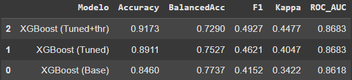

```

El umbral óptimo(≈0,614 en nuestra ejecución) se obtuvo maximizando F1 sobre predicciones OOF del entrenamiento y se aplicó al test.

### Matriz de confusión

A continuación, mostramos la matriz de confusión para este modelo final en el conjunto de prueba:

```
Matriz de confusión XGBoost (Tuned+thr):
 [[3320  164]
 [ 149  152]]
```

Esto indica que el modelo identifica correctamente 152 videojuegos de éxito(positivos verdaderos) y falla en 149(Falsos negativos). Además, al mismo tiempo, clasifica erróneamente 164 videojuegos como exitosos cuando no lo son(falsos positivos).


### Curvas ROC/PR

Para complementar esta evaluación, a continuación se presentan las curvas ROC y de Precisión-Recall, que permiten analizar el rendimiento del modelo a través de todos los posibles umbrales de decisión.


#### Curva ROC (Receiver Operating Characteristic)

```{r xboost_final_roc, echo=FALSE, fig.cap="", out.width="65%", fig.align='center'}

knitr::include_graphics("img/xgboost_final_roc.png")

```

La curva ROC evalúa la capacidad del modelo para discriminar entre las clases positiva y negativa. Un modelo ideal se acercaría a la esquina superior izquierda. El AUC, con un valor de "0,868", indica una capacidad de discriminación muy buena, significativamente superior al azar.


#### Curva Pde Precision-Recall (Receiver Operating Characteristic)

```{r xboost_final_pr, echo=FALSE, fig.cap="", out.width="65%", fig.align='center'}

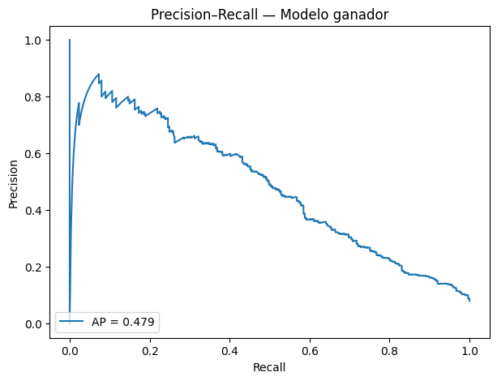

```

Esta curva es especialmente relevante en problemas con desbalance de clases, como es este caso. Muestra el trade-off entre la Precisión(porcentaje de precisiones correctas) y el Recall (qué porcentaje de los positivos reales son identificados). Un buen modelo mantiene una precisión alta a medida que aumenta el recall. 
En este caso, el valor de Precisión Promedio (AP) de 0,48 aproximadamente, lo que confirma que el modelo tiene un rendimiento predictivo sólido para la clase minoritaria.

## 6.4 Optimización del umbral de decisión por coste de negocio

Un modelo de clasificación binaria(0/1), utilizaría por defecto un umbral de 0,5 para asignar una clase. Sin embargo, en un caso real, los errores de predicción no tienen el mismo coste. En nuestro caso:
  - Falso negativo: (No predecir el éxito de un videojuego que acaba siéndolo). Representa una gran pérdida de oportunidad, inversión o marketing.
  - Falso positivo: (Predecir como exitoso un juego que fracasa). Supone una gran pérdida de inversión.
  
Para alinear el modelo con el objetivo de negocio, se asignó un mayor peso a los errores más costosos: los falsos negativos recibieron un valor cuatro veces superior al de los falsos positivos (c_fn=4 frente a c_fp=1). Con esta ponderación, se evaluó el coste total esperado a lo largo de distintos umbrales de decisión, identificando como óptimo el umbral de 0,55, en el que el coste se reduce a 740. Este punto equilibra mejor la detección de casos realmente exitosos, incrementando el recall y la balanced accuracy, aunque implique una ligera pérdida en precisión.

```{r coste_vs_umbral, echo=FALSE, fig.cap="", out.width="65%", fig.align='center'}

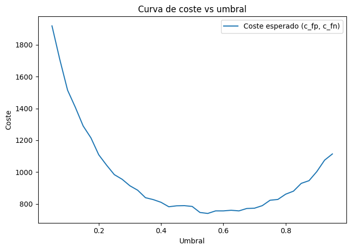

```


## 6.5. Validación temporal por año de lanzamiento

Con el fin de simular un escenario más realista, se llevó a cabo una validación temporal: el modelo se entrenó únicamente en años tempranos (≈80% del conjunto, lo cual acabó siendo "menor o igual que 2013) y se evaluó en los títulos posteriores. De esta manera, se reproduce la situación práctica de predecir el éxito de juegos futuros a partir de información histórica.


```{r val_temporal, eval=FALSE, echo=TRUE}

Split temporal: train ≤ 2013 (15538 filas), test > 2013 (3294 filas)

[XGBoost (Temporal holdout)]
Modelo         XGBoost (Temporal holdout)
Accuracy                         0.806011
BalancedAcc                      0.768797
F1                               0.339193
Kappa                            0.261545
ROC_AUC                          0.856966
dtype: object
Matriz de confusión:
 [[2491  577]
 [  62  164]]

Clasification report:
               precision    recall  f1-score   support

           0      0.976     0.812     0.886      3068
           1      0.221     0.726     0.339       226

    accuracy                          0.806      3294
   macro avg      0.599     0.769     0.613      3294
weighted avg      0.924     0.806     0.849      3294


```


Los resultados muestran un XGBoost con un accuracy del 0,806 y un AUC-ROC de 0,857, aproximadamente, lo que refleja una buena capacidad de discriminación. El modelo logra un recall elevado en la clase minoritaria(1) de ≈0,73, aunque con menor precisión (0,22), lo que explica el valor moderado del F1 (0,34). 
Esto indica que el modelo es especialmente eficaz para detectar posibles éxitos, incluso a costa de generar más falsos positivos, un compromiso razonable en un contexto donde las oportunidades perdidas son más costosas que las falsas alarmas.


# 7. Interpretación del modelo ganador

## 7.1. Importancia de variables

Por último, para entender cuáles son los factores que más/menos influyen en la predicción del modelo, hemos utilizado la técnica de "Importancia por Permutación". Esta técnica mide cuánto se degrada el rendimiento del modelo(en este caso, F1-Score) al permutar aleatoriamente los valores de una sola variable, rompiendo así su relación con la variable objetivo. Cuanto más cae el rendimiento, implica una mayor importancia con la variable. Estos son los resultados:

```{r permutacion, echo=FALSE, fig.cap="", out.width="50%", fig.align='center'}

knitr::include_graphics("img/importancia_por_permutacion.png")

```
```{r permutacion_data, echo=FALSE, fig.cap="", out.width="27.5%", fig.align='center'}

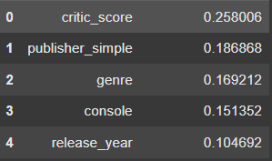

```

Los resultados muestran que, con diferencia, 'critic_score' es la variable más influyente en las predicciones del modelo.
Le siguen otras como 'publisher_simple', 'genre' y 'console'. El año de lanzamiento parece tener una menor importancia en comparación con el resto de variables.

# 8. Conclusiones

Este análisis, ha demostrado que es posible construir un modelo predictivo con un rendimiento razonable, para identificar videojuegos con potencial de exito(mayor de 1 millón de ventas), aún teniendo un desbalance tan fuerte en los datos.

El modelo más efectivo ha sido el XGBoost, optimizado, y con un umbral ajustado, consiguiendo un F1-Score de 0,493 en el conjunto de prueba. Este modelo, es especialmente útil en un contexto donde el coste de promocionar un "falso éxito" es considerable.

Además, el análisis de importancia de variables ha revelado que la puntuación de las críticas('critic_score'), es el factor más determinante para el modelo, seguido por el 'publisher_simple', el género ('genre') y la consola('console').


# 9. Bibliografía

- Documentación del Master.

- Guía para el Trabajo Fin de Master - UNED.pdf

- https://www.kaggle.com/datasets/ujjwalaggarwal402/video-games-dataset/data

- https://scikit-learn.org/stable/

- https://help.qlik.com/es-ES/cloud-services/Subsystems/Hub/Content/Sense_Hub/AutoML/permutation-importance.htm

- https://scikit-learn.org/stable/modules/permutation_importance.html

- https://rmarkdown.rstudio.com/authoring_basics.html

- https://seaborn.pydata.org/tutorial/introduction.html

- https://matplotlib.org/stable/users/explain/quick_start.html

- https://www.gamegrumble.com/which-video-game-genre-makes-the-most-money/

- https://xgboost.readthedocs.io/en/stable/

- https://www.marketingcenter.de/sites/mcm/files/downloads/research/lmm/literature/marchand_hennig-thurau_2013_jim_value_creation_in_the_video_game_industry_industry_economics_consumer_benefits_and_research_opportunities.pdf

- https://hastie.su.domains/ElemStatLearn/download.html (Descargar .pdf)


# 10. Anexos

**Este código ha sido exportado y copiado desde "Ivan_Araque_Lopez_Analisis_Videojuegos.ipynb", para ver el notebook completo(además de organizado por celdas, y con resultados ejecutados), pueden acceder a él en la carpeta 'anexos' dentro del proyecto, o a través del enlace encontrado a continuación.**

```{r anexos, eval=FALSE, echo=TRUE}

# -*- coding: utf-8 -*-
"""Ivan_Araque_Lopez_Analisis_Videojuegos.ipynb

Automatically generated by Colab.

Original file is located at
    https://colab.research.google.com/drive/1YNnEVqg9eqBsdbhASL1rJHM-z0reQZjD

## Carga de Datos
"""

# Tratamiento de datos
import pandas as pd
import numpy as np
import warnings
warnings.filterwarnings('ignore')

# Visualizaciones
import matplotlib.pyplot as plt
import seaborn as sns

# Leemos el dataset
# Para reproducir este paso, es necesario descargar el archivo desde su fuente original,
# o de la carpeta “data” en el proyecto, y ubicarlo en el directorio de trabajo.

df = pd.read_csv('Video Games Data.csv')

# Mostramos los primers registros
df.head()

# Mostramos la información del dataset
df.info()

df.describe()

"""# Análisis exploratorio de datos(EDA)

## Descripción inicial de los datos
"""

# Observamos los tipos(lo vimos anteriormente tambien en el df.info())

df.dtypes

# Muestra de métricas importantes
print(df.describe()) # para mostrar "números"

print(df.describe(include=['O'])) # para mostrar "strings"

"""## Pre-procesado y limpieza de datos"""

# Borramos la columna
df.drop(columns=['img'], inplace=True)

df.dtypes

# Parseo la fecha
df['release_date'] = pd.to_datetime(df['release_date'], errors='coerce')

df['last_update'] = pd.to_datetime(df['last_update'], errors='coerce')

df.dtypes

# Los publishers que no estén en el top 20, se llamarán "Other"
top_publishers = df["publisher"].value_counts().head(20).index
df["publisher_simple"] = np.where(df["publisher"].isin(top_publishers), df["publisher"], "Other")

# Tratamiento de NA

#Vemos cuantos valores NA hay en cada columna
values_na_perc = df.isna().mean() * 100
print(values_na_perc.sort_values(ascending=False))

# Developer tiene un porcentaje de NA bajo, vale la pena reemplazarlos
df['developer'].fillna('Unknown', inplace=True)

# Creo nueva columna de los días de vida(fecha desde que salío el juego, hasta su última update).
df['age_days'] = (df['last_update'] - df['release_date']).dt.days
df.loc[df['age_days'] < 0, 'age_days'] = np.nan #quito los negativos, para evitar posibles errores de calidad de datos.

df.head(5)

# Duplicados
duplicados = df.duplicated().sum()
print(f'Filas duplicadas: {duplicados}')
if duplicados > 0:
    print(df[df.duplicated(keep=False)].head(5))

# Conteo de valores únicos por columna (ayuda a ver cardinalidades)
print('')
print('Valores únicos')
print(df.nunique(dropna=False).sort_values(ascending=False))

#(por si acaso, normalizar el nombre de las columnas) (No utilizado al final en nuestro dataset)
#df.columns = df.columns.str.strip().str.lower()
#df.columns = df.columns.str.replace('_', ' ')

df.info()

# Separar variables numéricas y categóricas
numeric_cols = df.select_dtypes(include=[np.number]).columns.tolist()
categorical_cols = df.select_dtypes(exclude=[np.number]).columns.tolist()
print('Variables numéricas:', numeric_cols)
print('Variables categóricas:', categorical_cols)

# Histograma critic score
df['critic_score'].hist(bins=30)

# Distribución del critic_score
sns.histplot(df[df['critic_score']!=-1]['critic_score'], kde=True)
plt.title('Distribución de Critic Score')
plt.xlabel('Critic Score')
plt.ylabel('Frecuencia')
plt.show()

# Histograma edad videojuegos
df['age_days'].hist(bins=30)

# Boxplot de total sales
sns.boxplot(y=df['total_sales'])

# Con logaritmo, para mejor visualización
df['log_total_sales'] = np.log1p(df['total_sales']) #Aprovechamos y creamos la columna, por si la necesitamos más adelante.

sns.boxplot(y=df['log_total_sales'])

# Función gráfico top n
# Plot simple de categorías
# Reutilizable, con tercer parámetro opcional(10 por defecto)

def plot_top_n(column, title, n=10):

    data = df

    if column == 'publisher':
        data = data[data['publisher'].astype(str).str.lower() != 'unknown'] #Quitamos los valores de "Unknown" en caso de que la columna sea 'publisher'

    top_n = data[column].value_counts().head(n)

    plt.figure(figsize=(8, 4))
    plt.bar(top_n.index, top_n.values)
    plt.xticks(rotation=45, ha='right')
    plt.title(title)
    plt.xlabel(column.capitalize())
    plt.ylabel('Número de juegos')
    plt.tight_layout()
    plt.show()

plot_top_n('genre', 'Top 10 géneros')
plot_top_n('console', 'Top 10 consolas')
plot_top_n('publisher', 'Top 10 publishers') #(Sin "Unknown")

# Si quiero ver cómo evolucionan en el tiempo
def plot_top_n_timeseries(category_col, time_col, value_col, n=5):

    # Por tiempo, y categoría
    g = (df.dropna(subset=[time_col, value_col])
           .groupby([category_col, time_col])[value_col]
           .sum()
           .reset_index())

    # Top-N categorías por total acumulado
    topN = (g.groupby(category_col)[value_col]
              .sum()
              .sort_values(ascending=False)
              .head(n)
              .index)

    plt.figure(figsize=(9, 5))
    for cat in topN:
        sub = g[g[category_col] == cat].sort_values(time_col)
        plt.plot(sub[time_col], sub[value_col], label=str(cat))

    plt.title(f"Evolución de {value_col} por {category_col} — Top {n}")
    plt.xlabel(time_col)
    plt.ylabel(value_col)
    plt.legend()
    plt.tight_layout()
    plt.show()

# Ya lo hemos convertido antes a fecha (datetime)

df['release_year'] = df['release_date'].dt.year.astype('Int64') # Año como entero
# Utilizamos el año en vez de la fecha, si no, la gráfica va saltando de fecha en fecha

plot_top_n_timeseries(
    category_col='console',
    time_col='release_year',
    value_col='total_sales',
    n=5
)

# Para ver el crecimiento de las consolas en comparación(desde su año de salida)
def plot_top_n_timeseries_aligned(category_col, time_col, value_col, n=5, cumulative=False):
    # Agrupar por categoría y año
    g = (df.dropna(subset=[category_col, time_col, value_col])
           .groupby([category_col, time_col])[value_col]
           .sum()
           .reset_index())

    # Top N categorías por total acumulado
    topN = (g.groupby(category_col)[value_col]
              .sum()
              .sort_values(ascending=False)
              .head(n)
              .index)

    # Año de lanzamiento por categoría
    launch_year = (g.groupby(category_col)[time_col]
                     .min()
                     .rename('launch_year'))
    g = g.merge(launch_year, on=category_col, how='left')

    # Años desde lanzamiento
    g['years_since_launch'] = g[time_col] - g['launch_year']

    plt.figure(figsize=(9, 5))
    for cat in topN:
        sub = g[g[category_col] == cat].sort_values('years_since_launch').copy()

        # Ventas acumuladas para ver la curva de crecimiento
        y = sub[value_col].cumsum() if cumulative else sub[value_col]

        plt.plot(sub['years_since_launch'], y, label=str(cat))

    ttl = f"Evolución de {value_col}{' (acumulado)' if cumulative else ''} alineada — Top {n}"
    plt.title(ttl)
    plt.xlabel("Años desde lanzamiento")
    plt.ylabel(value_col)
    plt.legend()
    plt.tight_layout()

    plt.show()

plot_top_n_timeseries_aligned(
    category_col='console',
    time_col='release_year',
    value_col='total_sales',
    n=5
)

# Para ver mejor el crecimiento de las ventas en comparación con el resto, utilizamos una curva acumulada
plot_top_n_timeseries_aligned(
    category_col='console',
    time_col='release_year',
    value_col='total_sales',
    n=5,
    cumulative=True
)

import plotly.express as px

# Sumar ventas por región
region_sales = {
    "North America": df["na_sales"].sum(),
    "Europe": df["pal_sales"].sum(),
    "Japan": df["jp_sales"].sum(),
    "Other": df["other_sales"].sum()
}

# Convertir a DataFrame
region_df = pd.DataFrame(list(region_sales.items()), columns=["Region", "Sales"])

# Mapeo a países reales
region_to_country = {
    "North America": "United States",
    "Europe": "France",
    "Japan": "Japan",
    "Other": "Australia"
}
region_df["Country"] = region_df["Region"].map(region_to_country)

region_df["Sales_M"] = region_df["Sales"]

# Crear el mapa con mejoras
fig = px.choropleth(
    region_df,
    locations="Country",
    locationmode="country names",
    color="Sales_M",
    hover_name="Region",
    color_continuous_scale="YlOrRd",
    title="Ventas Totales por Región (en millones)",
    projection="natural earth"
)

# Formato del hover y título más grande
fig.update_traces(
    hovertemplate='%{hovertext}<br>Ventas: %{z:.2f}M<extra></extra>'
)
fig.update_layout(
    width=700,
    height=500,
    title_font=dict(size=20),
    coloraxis_colorbar=dict(title="Millones")
)

fig.show()

# Distribución de total_sales(utilizamos el log creado anteriormente, para una mejor visualización)
df['log_total_sales'].hist(bins=50)
plt.title('Distribución log_total_sales')
plt.xlabel('log(ventas + 1)')
plt.ylabel('frecuencia')
plt.show()

# Scatterplot critica y ventas

plt.figure(figsize=(10, 6))

# Usamos 'alpha=0.5' para que los puntos se vean mejor
sns.scatterplot(data=df, x='critic_score', y='total_sales', alpha=0.5)

# Utilizamos la escala logarítmica para manejar la asimetría de las ventas
plt.yscale('log')

plt.title('Relación entre Puntuación de la Crítica y Ventas Totales', fontsize=16)
plt.xlabel('Puntuación de la Crítica (Critic Score)', fontsize=12)
plt.ylabel('Ventas Totales (en millones, escala logarítmica)', fontsize=12)
plt.grid(True, which="both", ls="--", linewidth=0.5)

plt.show()

# Gráfico de barras con suma de ventas por consola

plt.figure(figsize=(12,6))

sns.barplot(
    data=df,
    x='console',
    y='total_sales',
    estimator=sum,
    order=df.groupby('console')['total_sales'].sum().sort_values(ascending=False).index,
    palette="Blues_d"
)

plt.yscale('log')  # escala logarítmica para ver bien la diferencia
plt.title('Ventas Totales por Consola', fontsize=16)
plt.xlabel('Consola', fontsize=12)
plt.ylabel('Ventas Totales (en millones, escala logarítmica)', fontsize=12)
plt.xticks(rotation=45, fontsize=7)
plt.grid(True, which="both", ls="--", linewidth=0.5)

plt.show()

"""## Estudio de posibles correlaciones de variables"""

# Análisis de correlación (Ventas)
# Antes de calcular correlaciones, filtramos filas con datos completos en ventas.
cols_ventas = ['total_sales', 'na_sales', 'jp_sales', 'pal_sales', 'other_sales']

df_sales = df[cols_ventas].dropna()

# Matriz de correlaciones
corr_matrix = df_sales.corr()

# Visualización con mapa de calor

plt.figure(figsize=(10, 6))
sns.heatmap(corr_matrix, annot=True, cmap='coolwarm', linewidths=1)
plt.title('Matriz de correlación entre ventas por regiones')
plt.show()

"""# Modelos de predicción"""

# Cálculo de porcentaje de éxito, para hacernos una idea previa(futura variable success).

# Filtramos registros válidos
valid_sales = df.dropna(subset=['total_sales'])

# Calcular clases
success_count = (valid_sales['total_sales'] >= 1.0).sum()
fail_count = (valid_sales['total_sales'] < 1.0).sum()

# Calcular porcentaje sobre válidos
porcentaje_sobre_validos = success_count / len(valid_sales) * 100
print(f"Porcentaje de éxito sobre registros con datos de ventas: {porcentaje_sobre_validos:.2f}%")

# Gráfico
plt.figure(figsize=(6,6))
plt.pie(
    [success_count, fail_count],
    labels=["\nÉxito (≥1M)", "No éxito"],
    autopct='%1.2f%%',
    colors=["#4171d1", "#5e5e5e"], # Azul / Gris
    startangle=90
)
plt.title("Proporción de 'sucess' en 'total_sales'", fontsize=14, fontweight="bold")
plt.axis('equal')
plt.show()

# Imports y semilla para replicación.
SEED = 1234
np.random.seed(SEED)

# Imports preprocesado
from sklearn.model_selection import train_test_split
from sklearn.compose import ColumnTransformer
from sklearn.pipeline import Pipeline
from sklearn.impute import SimpleImputer
from sklearn.preprocessing import OneHotEncoder, StandardScaler
from sklearn.model_selection import train_test_split, StratifiedKFold, cross_validate, RandomizedSearchCV, cross_val_predict  # ROC/Curvas
from sklearn.metrics import (accuracy_score, balanced_accuracy_score, f1_score, roc_auc_score,
                             cohen_kappa_score, confusion_matrix, classification_report,
                             precision_recall_curve, # PR
                             make_scorer)

# Imports modelos
from sklearn.linear_model import LogisticRegression
from sklearn.svm import LinearSVC
from sklearn.calibration import CalibratedClassifierCV
from sklearn.tree import DecisionTreeClassifier
from sklearn.ensemble import RandomForestClassifier, HistGradientBoostingClassifier

# Datos y preprocesado común

# XGBoost
try:
    from xgboost import XGBClassifier
    XGB_OK = True
except Exception:
    XGB_OK = False


# Datos base
if 'df_base' not in globals(): df_base = df.dropna(subset=["total_sales"]).copy()
if 'num_features' not in globals(): num_features = ["critic_score"]
if 'cat_features' not in globals(): cat_features = ["console","genre","release_year","publisher_simple"]
num_features = [c for c in num_features if c in df_base.columns]
cat_features = [c for c in cat_features if c in df_base.columns]
for c in num_features: df_base[c] = pd.to_numeric(df_base[c], errors="coerce")
for c in cat_features: df_base[c] = df_base[c].astype("object")
df_base[num_features+cat_features] = df_base[num_features+cat_features].replace({pd.NA: np.nan})

# Preprocesado
if 'preprocess' not in globals():
    preprocess = ColumnTransformer([
        ("num", Pipeline([("imputer", SimpleImputer(strategy="median")),
                          ("scaler",  StandardScaler())]), num_features),
        ("cat", Pipeline([("imputer", SimpleImputer(strategy="most_frequent")),
                          ("onehot",  OneHotEncoder(handle_unknown="ignore", sparse_output=False))]), cat_features)
    ])

# Etiqueta binaria, partición y peso de clase para desbalance

df_clf = df_base.copy()
df_clf["success"] = (df_clf["total_sales"] >= 1.0).astype(int)   # condición: mayor de 1 millón

X, y = df_clf[num_features + cat_features].copy(), df_clf["success"]
if all(v in globals() for v in ["X_train_c","X_test_c","y_train_c","y_test_c"]):
    X_train, X_test, y_train, y_test = X_train_c, X_test_c, y_train_c, y_test_c
else:
    X_train, X_test, y_train, y_test = train_test_split(X, y, test_size=0.20, random_state=SEED, stratify=y)

# Ratio negativos/positivos(en train)
neg, pos = (y_train==0).sum(), (y_train==1).sum()
SCALE_POS_WEIGHT = float(neg)/max(1.0, float(pos))
print(f"Prevalencia train: {y_train.mean():.3f} | test: {y_test.mean():.3f} | scale_pos_weight≈{SCALE_POS_WEIGHT:.2f}")

# Métricas, CV y funciones de evaluación

scoring = {"accuracy":"accuracy","balanced_accuracy":"balanced_accuracy","f1":"f1",
           "roc_auc":"roc_auc","kappa":make_scorer(cohen_kappa_score)}
cv = StratifiedKFold(n_splits=5, shuffle=True, random_state=SEED)

def evaluar(model, Xt, yt, nombre):
    """Evalúa con umbral por defecto (0.5)."""
    y_pred = model.predict(Xt)
    auc = (roc_auc_score(yt, model.predict_proba(Xt)[:,1]) if hasattr(model,"predict_proba")
           else roc_auc_score(yt, model.decision_function(Xt)) if hasattr(model,"decision_function") else np.nan)
    out = {"Modelo":nombre,
           "Accuracy":accuracy_score(yt,y_pred),
           "BalancedAcc":balanced_accuracy_score(yt,y_pred),
           "F1":f1_score(yt,y_pred),
           "Kappa":cohen_kappa_score(yt,y_pred),
           "ROC_AUC":auc}
    print(f"\n[{nombre}]"); print(pd.Series(out).round(4))
    print("Matriz de confusión:\n", confusion_matrix(yt, y_pred))
    print("\nClasification report:\n", classification_report(yt, y_pred, digits=3))
    return out

def evaluar_con_umbral(model, Xt, yt, thr, nombre):
    """Evalúa fijando un umbral custom (probabilidad/score ≥ thr → clase 1)."""
    s = model.predict_proba(Xt)[:,1] if hasattr(model,"predict_proba") else model.decision_function(Xt)
    y_pred = (s >= thr).astype(int)
    out = {"Modelo":nombre,
           "Accuracy":accuracy_score(yt,y_pred),
           "BalancedAcc":balanced_accuracy_score(yt,y_pred),
           "F1":f1_score(yt,y_pred),
           "Kappa":cohen_kappa_score(yt,y_pred),
           "ROC_AUC":roc_auc_score(yt,s)}
    print(f"\n[{nombre}]  thr={thr:.3f}"); print(pd.Series(out).round(4))
    print("Matriz de confusión:\n", confusion_matrix(yt, y_pred))
    print("\nClasification report:\n", classification_report(yt, y_pred, digits=3))
    return out

# Modelos base, comparación por CV y entrenamiento final único

modelos = {
    "Logistic Regression": LogisticRegression(max_iter=1000, class_weight="balanced", random_state=SEED),
    "Linear SVM (Calibrated)": CalibratedClassifierCV(
        estimator=LinearSVC(class_weight="balanced", random_state=SEED),
        method="sigmoid", cv=3
    ),
    "Decision Tree": DecisionTreeClassifier(max_depth=None, min_samples_leaf=2,
                                            class_weight="balanced", random_state=SEED),
    "Random Forest": RandomForestClassifier(n_estimators=400, class_weight="balanced",
                                            random_state=SEED, n_jobs=-1),
    ("XGBoost" if XGB_OK else "HistGBClassifier"):
        (XGBClassifier(n_estimators=400, learning_rate=0.1, max_depth=6,
                       subsample=0.9, colsample_bytree=0.9, reg_lambda=1.0, reg_alpha=0.0,
                       scale_pos_weight=SCALE_POS_WEIGHT,  # ajuste por desbalance
                       random_state=SEED, n_jobs=-1, eval_metric="logloss",
                       objective="binary:logistic", tree_method="hist")
         if XGB_OK else
         HistGradientBoostingClassifier(max_depth=None, learning_rate=0.1,
                                        max_iter=400, random_state=SEED))
}

resultados, pipelines_entrenados = [], {}
for nombre, clf in modelos.items():
    pipe  = Pipeline([("prep", preprocess), ("clf", clf)])
    cvres = cross_validate(pipe, X_train, y_train, cv=cv, scoring=scoring, n_jobs=-1)
    resultados.append({
        "Modelo":             nombre,
        "Accuracy":           cvres["test_accuracy"].mean(),
        "Balanced Accuracy":  cvres["test_balanced_accuracy"].mean(),
        "F1":                 cvres["test_f1"].mean(),
        "Kappa":              cvres["test_kappa"].mean(),
        "ROC AUC":            cvres["test_roc_auc"].mean()
    })
    pipe.fit(X_train, y_train)  # fit final del base (train completo)
    pipelines_entrenados[nombre] = pipe

tabla_cv = pd.DataFrame(resultados).sort_values(
    by=["F1", "Balanced Accuracy", "ROC AUC"], ascending=False
)
display(tabla_cv.round(4))

mejor_nombre = tabla_cv.iloc[0]["Modelo"]
print("\nMejor por CV (F1/BalAcc):", mejor_nombre)
mejor_base = pipelines_entrenados[mejor_nombre]

# Tuning corto del modelo con mejores resultados
# (En este caso, ha sido el XGBoost)

param_spaces = {}
if   mejor_nombre == "Random Forest":
    param_spaces = {"clf__n_estimators":[300,500,800],"clf__max_depth":[None,8,16],
                    "clf__min_samples_leaf":[1,2,5],"clf__max_features":["sqrt",0.5,0.8]}
elif mejor_nombre == "Decision Tree":
    param_spaces = {"clf__max_depth":[None,6,10,16],"clf__min_samples_leaf":[1,2,5,10],
                    "clf__criterion":["gini","entropy","log_loss"]}
elif mejor_nombre == "Logistic Regression":
    param_spaces = {"clf__C":[0.1,0.5,1.0,2.0,5.0],"clf__penalty":["l2"],"clf__solver":["lbfgs","liblinear"]}
elif mejor_nombre == "Linear SVM (Calibrated)":
    param_spaces = {"clf__base_estimator__C":[0.1,0.5,1.0,2.0,5.0]}
elif mejor_nombre == "XGBoost":
    param_spaces = {"clf__n_estimators":[300,600,900],
                    "clf__learning_rate":[0.05,0.1,0.2],
                    "clf__max_depth":[3,6,8],
                    "clf__subsample":[0.8,1.0],
                    "clf__colsample_bytree":[0.7,0.9,1.0],
                    "clf__reg_lambda":[0.5,1.0,2.0],
                    "clf__scale_pos_weight":[SCALE_POS_WEIGHT*0.5, SCALE_POS_WEIGHT, SCALE_POS_WEIGHT*1.5]}

best_model = mejor_base
if param_spaces:
    tuner = RandomizedSearchCV(mejor_base, param_spaces, n_iter=16, scoring="f1", cv=cv, n_jobs=-1,
                               random_state=SEED, verbose=0)
    tuner.fit(X_train, y_train)
    best_model = tuner.best_estimator_
    print("\nMejores hiperparámetros:", tuner.best_params_)

# Umbral óptimo (max F1) y evaluación final (en test)

meth = "predict_proba" if hasattr(best_model, "predict_proba") else "decision_function"
scores_oof = cross_val_predict(best_model, X_train, y_train, cv=cv, method=meth)
if meth == "predict_proba": scores_oof = scores_oof[:,1]
p, r, thr = precision_recall_curve(y_train, scores_oof)
f1s = 2*p*r/(p+r+1e-12)
thr_star = float(thr[np.argmax(f1s[:-1])])   # umbral que maximiza F1 en OOF

res_base  = evaluar(mejor_base, X_test, y_test, f"{mejor_nombre} (Base)")
res_tuned = evaluar(best_model,  X_test, y_test, f"{mejor_nombre} (Tuned)")
res_thr   = evaluar_con_umbral(best_model, X_test, y_test, thr_star, f"{mejor_nombre} (Tuned+thr)")

tabla_final = (pd.DataFrame([res_base, res_tuned, res_thr])
               [["Modelo","Accuracy","BalancedAcc","F1","Kappa","ROC_AUC"]]
               .sort_values(by=["F1","BalancedAcc","ROC_AUC"], ascending=False))
display(tabla_final.round(4))

# Curvas ROC y Precision–Recall(del ganador)
# (usa best_model ya entrenado y el umbral thr_star calculado)

from sklearn.metrics import roc_curve, roc_auc_score, precision_recall_curve, average_precision_score

# Scores del ganador en TEST
if hasattr(best_model, "predict_proba"):
    scores_test = best_model.predict_proba(X_test)[:, 1]
else:
    scores_test = best_model.decision_function(X_test)

# ROC
fpr, tpr, roc_thr = roc_curve(y_test, scores_test)
auc = roc_auc_score(y_test, scores_test)

plt.figure(figsize=(7,5))
plt.plot(fpr, tpr, label=f"AUC = {auc:.3f}")
plt.plot([0,1],[0,1],'--')
plt.xlabel("False Positive Rate"); plt.ylabel("True Positive Rate"); plt.title("ROC — Modelo ganador")
plt.legend(loc="lower right")
plt.show()

# Precision–Recall
prec, rec, pr_thr = precision_recall_curve(y_test, scores_test)
ap = average_precision_score(y_test, scores_test)

plt.figure(figsize=(7,5))
plt.plot(rec, prec, label=f"AP = {ap:.3f}")
plt.xlabel("Recall"); plt.ylabel("Precision"); plt.title("Precision–Recall — Modelo ganador")
plt.legend(loc="lower left")
plt.show()

# Importancia de variables (Permutation Importance)

from sklearn.inspection import permutation_importance

rng = np.random.RandomState(SEED)
n_pi = min(1000, len(X_test))
idx = rng.choice(len(X_test), size=n_pi, replace=False)
X_pi, y_pi = X_test.iloc[idx], y_test.iloc[idx]

pi = permutation_importance(best_model, X_pi, y_pi, n_repeats=5, random_state=SEED, scoring="f1", n_jobs=-1)
imp = pd.Series(pi.importances_mean, index=X_test.columns).sort_values(ascending=False)

top = imp.head(10)
ax = top.sort_values().plot(kind="barh", figsize=(7,5))
ax.set_title("Importancia por Permutación (F1)")
ax.set_xlabel("Disminución media de F1 al permutar")
plt.tight_layout(); plt.show()

top_df = top.reset_index()
top_df.columns = ["feature","importance_mean"]
display(top_df)

# Umbral vs coste: curva y umbral mínimo coste

from sklearn.metrics import confusion_matrix, f1_score, balanced_accuracy_score

# Costes relativos: FP (falso positivo) y FN (falso negativo)
c_fp, c_fn = 1.0, 4.0
thr_grid = np.linspace(0.05, 0.95, 37)

def counts_for_threshold(scores, y_true, thr):
    y_pred = (scores >= thr).astype(int)
    tn, fp, fn, tp = confusion_matrix(y_true, y_pred).ravel()
    return tn, fp, fn, tp

costs, f1s = [], []
for thr in thr_grid:
    tn, fp, fn, tp = counts_for_threshold(scores_test, y_test, thr)
    costs.append(c_fp*fp + c_fn*fn)
    f1s.append((2*tp) / max(1, 2*tp + fp + fn))

thr_min = float(thr_grid[int(np.argmin(costs))])
cost_min = float(np.min(costs))

plt.figure(figsize=(7,5))
plt.plot(thr_grid, costs, label="Coste esperado (c_fp, c_fn)")
plt.xlabel("Umbral"); plt.ylabel("Coste")
plt.title("Curva de coste vs umbral")
plt.legend(); plt.tight_layout(); plt.show()

print(f"Umbral de menor coste (c_fp={c_fp}, c_fn={c_fn}): thr* = {thr_min:.3f}  |  coste = {cost_min:.0f}")

def quick_metrics_at(thr):
    y_pred = (scores_test >= thr).astype(int)
    return {
        "thr": thr,
        "F1": f1_score(y_test, y_pred),
        "BalancedAcc": balanced_accuracy_score(y_test, y_pred),
        "Precision": ((y_pred & (y_test==1)).sum() / max(1, (y_pred==1).sum())),
        "Recall": ((y_pred & (y_test==1)).sum() / max(1, (y_test==1).sum()))
    }

comp = pd.DataFrame([quick_metrics_at(thr_star), quick_metrics_at(thr_min)])
display(comp)

# Validación temporal(por release_year)
# (entrena en años tempranos y evalúa en años recientes)

years = pd.to_numeric(df_clf["release_year"], errors="coerce")
mask_valid = years.notna()
Xy = df_clf.loc[mask_valid, :]
years = years.loc[mask_valid]

# Entrenamos hasta el percentil 80 de años y test en el tramo más reciente
y_cut = np.nanpercentile(years, 80)
tr_mask = years <= y_cut
te_mask = years >  y_cut

X_tr, X_te = Xy.loc[tr_mask, num_features+cat_features], Xy.loc[te_mask, num_features+cat_features]
y_tr, y_te = Xy.loc[tr_mask, "success"],              Xy.loc[te_mask, "success"]

# Re-entrenar el ganador(con la misma configuración) y evaluar
ganador = best_model
ganador.fit(X_tr, y_tr)

print(f"Split temporal: train ≤ {int(y_cut)} ({tr_mask.sum()} filas), test > {int(y_cut)} ({te_mask.sum()} filas)")
_ = evaluar(ganador, X_te, y_te, f"{mejor_nombre} (Temporal holdout)")

```